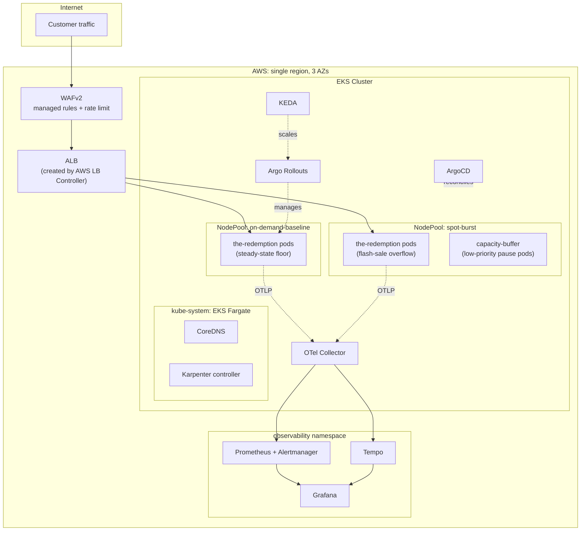

# The Redemption: Architecture

## System overview

## A. Compute & Architecture

- EKS, 1 region, 3 AZs
- **Karpenter** provisions workers spread across AZs, baseline of on-demand nodes and burst of Spot nodes
- **No Cluster Autoscaler and no system managed node groups**.
  Cluster Autoscaler scales pre-sized node groups in minutes; Karpenter provisions
  right-sized EC2 capacity sub-minute.
- **Bottlerocket**, AWS's container-optimized,
  immutable OS for EKS: minimal boot footprint, fast node start.
- Cluster-critical components CoreDNS and Karpenter run on a dedicated **EKS Fargate** profile:
  - Breaks the bootstrap chicken-and-egg: an empty cluster couldn't otherwise scale
    itself from/to zero for development environments.
  - Isolates blast radius: DNS is cluster-critical and shouldn't churn with Spot
    interruptions or an AZ failure.
  - No system node pool to size or patch: system pods never compete with app pods for
    scheduling or wait on a node to be provisioned.
- **Availability**: a hard zone-level topology spread constraint on every application pod caps how
  much of the app can land in one AZ; a softer node-level constraint limits blast
  radius from a single node loss.
- **Infrastructure failure**:
  - AZ failure: spread guarantees even distribution; Karpenter reschedules into
    surviving AZs; networking and load balancing are both multi-AZ.
  - Node or Spot interruption: Karpenter reschedules proactively on the interruption
    notice.
  - Voluntary disruption (drain, consolidation, upgrade): a **PodDisruptionBudget** caps
    evictions so the app's own churn can't drop it below the threshold.
- **Bad deployment**: canary rollout with automated analysis and rollback with **Argo Rollouts**

## B. Scalability Strategy

- **Node autoscaling: Karpenter**, two tiers separated by an *enforced* capacity
  ceiling:
  - **On-demand baseline**, sized to steady-state traffic. Once its ceiling saturates, the
    scheduler physically can't place more pods there, so a 10x spike's overflow lands on
    the burst tier.
  - **Spot burst tier**, diversified instance types, absorbing everything past the
    baseline.
  - **Large diversity of instance types** in the burst tier, so a single Spot pool's exhaustion doesn't
    block the spike.
- The baseline tier reclaims nodes only once empty. Nodes also expire on a fixed lifetime to prevent
  drift and hidden problems.
- **Pod autoscaling: KEDA**, two triggers, max from both:
  - Prometheus request-rate metrics (reactive), not CPU/memory.
  - Schedule (proactive): pre-warms replica count ~15–30 minutes before an announced
    sale, so pods, and the nodes behind them, exist *before* the spike.
- **Pre-warmed node overcapacity**: low-priority placeholder pods sit on
  the spot-burst tier, giving one node's worth of prewarm. When KEDA scales up application replicas,
  placeholders are evicted and new application pods take their place.
  That capacity already exists, so the app doesn't wait for a fresh node. The evicted
  placeholders, now unschedulable, trigger Karpenter to provision a new node, refilling
  the buffer.

## C. Security & Networking

- Single VPC, 3 AZs, three subnet tiers per zone:
  - Public: load balancer and NAT only, no workloads.
  - Private: nodes and pods, (pod-density optimization activated) 10x scale-out never risks IP exhaustion mid-spike.
  - Data layer: no route to the internet at all, reserved for a future database tier.
- **NAT**: one NAT Gateway per AZ, standard HA pattern.
- Traffic to ECR, STS, S3 .. private via GATEWAY/VPC endpoints.
- **Identity: EKS Pod Identity by default.** Every component gets its own
  narrowly-scoped AWS role tied to its own Kubernetes ServiceAccount.
- **IRSA, only for Karpenter's controller**: Pod Identity doesn't work on Fargate. IRSA is the fallback
- The application's own AWS identity is a least-privilege placeholder with zero
  permissions attached today only needs to attach a policy, without touching application manifests.
- **Defense in depth**:
  1. Edge: **AWS WAFv2** managed rule groups, plus a rate-based rule deliberately
     generous enough not to punish legitimate flash-sale traffic while still catching
     per-IP abuse.
  2. Network (coarse): Security Groups for Pods, scoped to the VPC CIDR and the
     application's port only.
  3. Network (fine): **Kubernetes NetworkPolicy**, default-deny with explicit allows.
  4. Admission: **Kyverno** ClusterPolicies enforce non-root, no privileged
     containers, mandatory resource limits, mandatory health probes, and no mutable
     image tags, as policy as code.
  5. Secrets: **External Secrets Operator** pulls from **AWS Secrets Manager** at
     runtime through its own scoped Pod Identity role.
  6. Encryption: at rest for cluster secrets and storage, in transit throughout.
  7. Audit: control-plane activity logged centrally.
- **Naming and tagging** follow one consistent pattern threaded through every layer,
  built environment-agnostic from day one.

## D. Reliability & Observability

**Measuring health**:
- **OpenTelemetry** → **OTel Collector** → **Prometheus** (metrics) / **Tempo**
  (traces) → **Grafana**
- **Three SLO alerts** define "healthy": error rate > 1% for 5m, p99 latency > 500ms
  for 5m, and available replicas < 66% for 2m

**Recovering from failures, with minimal customer impact**:
- **Bad deployment**: **Argo Rollouts** runs a canary, ramping traffic 10% → 25% →
  50% → 100% with pauses between steps, gated by an `AnalysisTemplate` that queries
  Prometheus for the same error-rate/latency.
- **AZ outage**: recovery is automatic. Topology spread already keeps
  replicas even across AZs; Karpenter reschedules into the survivors; ALB and NAT keep
  serving.

## E. Operations

- **Day-2 toil**:
  - **ArgoCD**: every change is a PR, reconciled from the repo
  - **Kyverno** + **checkov** +  **kubeconform** : tagging/security conventions as policy-as-code, not a
    checklist.
  - **Bottlerocket**: no OS patching workflow; updates via node replacement.
  - 24h node `expireAfter`: drift can't silently accumulate past a day.

- **Considered, not used**:
  - **EKS Auto Mode**: AWS's bundled Karpenter + managed load balancing + managed
    storage would cut even more toil than self-managed Karpenter + AWS LB Controller.
    Not used here because self-managed gives more direct control over the NodePool
    tiering and disruption-budget mechanics.
  - **Amazon Managed Prometheus + Amazon Managed Grafana**: the more direct answer to
    "minimize Day-2 toil" for observability. AWS would own storage/HA/upgrades of the
    metrics backend entirely. Self-hosted **kube-prometheus-stack** + **Tempo** used
    instead, trading that toil reduction for full control over retention, PromQL, and
    dashboards.

- **Versioning: one minor version behind latest by default.** Applies to the EKS
  control plane and every other pinned version (Terraform providers, Helm charts,
  Karpenter/ArgoCD/Argo Rollouts). Lets the ecosystem catch up before this cluster
  runs a release; jump to newest only when a specific feature is the actual reason.

- **Task assignment: 1 Senior, 2 Junior engineers.** See
  [`TEAM-PLAN.md`](TEAM-PLAN.md) for the full breakdown, review gates, and suggested
  sequencing.

## Trade-offs and alternatives considered

- **EKS Auto Mode**: trade control for less toil but more expensive and less flexible.
- **Self-hosted vs. AWS-managed observability**: see section D; chosen for control over
  retention/dashboards, at the cost of owning HA/storage/upgrades ourselves.
- **Single-region, 3 AZs vs. multi-region active-active**: single-region chosen: covers
  the failure mode the assessment actually names (AZ outage), at far less complexity
  (global data replication/consistency, cross-region networking) than active-active. A
  full regional outage would still be an outage under this design; revisit if that
  specific SLA is required.
- **Regional NAT Gateway**: a single VPC-scoped NAT Gateway, fewer resources than one
  per AZ but isn't wired into the vpc module yet.
- **KEDA HTTP trigger instead of `cron`**: an HTTP endpoint a CRM/booking system calls
  to signal an actual flash sale would trigger the pre-warm dynamically, instead of
  someone pre-configuring `cron` job ahead of time.
- **Terragrunt instead of plain Terraform**: would DRY up the backend/provider
  boilerplate and automate the remote-state wiring and its backend
  config generated instead of copy-pasted.
- **[Karpenter's native CapacityBuffers](https://karpenter.sh/docs/concepts/capacitybuffers/),
  instead of the pause-pod trick**: virtual placeholder pods that pre-provision spare
  node capacity and auto-refill. Still Alpha.
